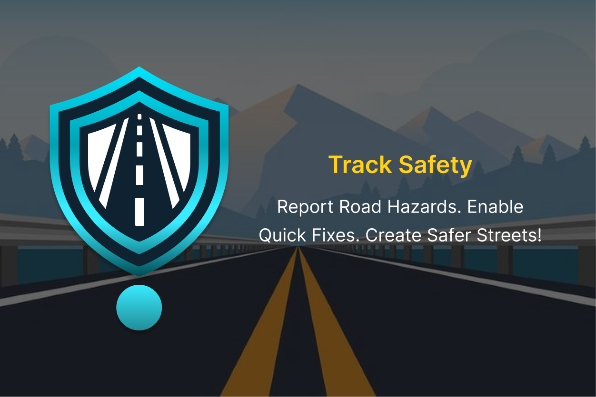
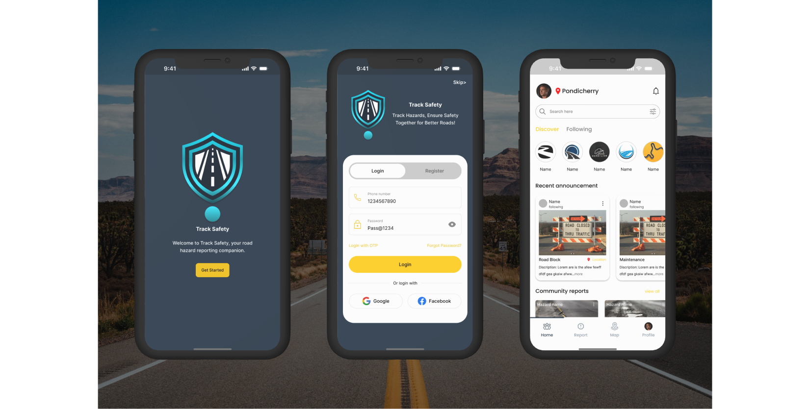
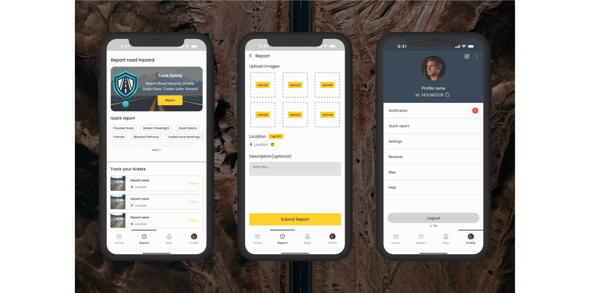
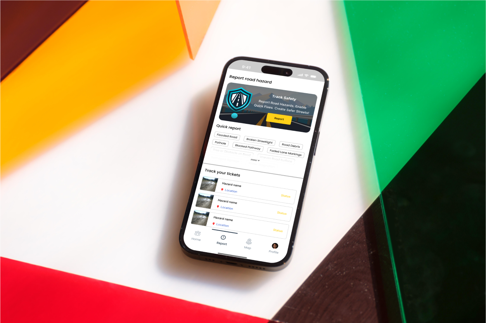

# 🚧 Track Safety – Community Road Hazard Reporting App

## 📌 Project Overview
**Track Safety** is a **mobile-based** application designed to empower citizens to report road hazards such as potholes, water stagnation, road debris, and damaged signage. The app features an **intuitive UI/UX**, ensuring seamless reporting, issue tracking, and effective communication with authorities.

**Demo link:** https://gukanr007.github.io/tracksafety/

## 🎨 UI/UX & Design
- Designed an **intuitive and accessible** mobile interface for effortless hazard reporting.
- Developed **interactive wireframes** and high-fidelity prototypes using **Figma**.
- Implemented **clean navigation**, **easy reporting flows**, and **real-time issue tracking UI**.
- Ensured **inclusivity** by designing a **toll-free call reporting** feature for non-smartphone users.

## 📱 Key UI Features
- 🔹 **Home Dashboard** – View reported hazards, track status, and see road conditions in real time.
- 📍 **Hazard Reporting** – Capture & upload images, auto-fetch GPS location, and add descriptions.
- 📊 **Live GIS Mapping** – Visual representation of active reports and resolved issues.
- 🎟 **Ticket Tracking** – Users can track submitted reports with real-time updates.
- 📢 **Authority Dashboard** – Role-based interface for managing reports and assigning tasks.
- 🏆 **Gamification** – Reward system for active users who contribute validated reports.

## 🚀 Tools & Technologies
- **UI/UX Design**: Figma
- **Prototyping & Wireframing**: Adobe XD, Figma
- **Design Approach**: Material Design principles for a smooth user experience

## 📷 Screenshots & UI/UX Design

